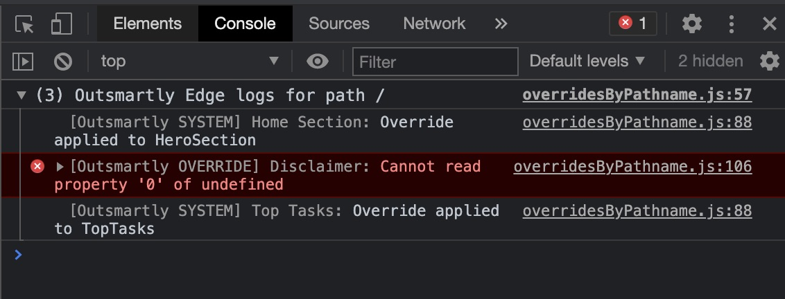

# Troubleshooting / Debugging

Outsmartly offers a number of helpers that can greatly simplify the process of debugging code running across our edge networks.

## Overrides

Overrides are a core product offering of Outsmartly, allowing you to write code that will run across our edge networks and modify \(or 'override'\) the default props that were originally passed into your React components during Static Site Generation or Server Side Rendering.

To aid with debugging Outsmartly ships logging from the edge to the Browser's console. There are two types of logs that can be viewed in the browser's console:

### 1. Outsmartly default and error logs.

Outsmartly's logs will notify you of error that may have occured when running your code on our edge servers.



### 2. User generated logs from logging calls in your code.

Users may also write explicit logging statements of their own. This is possible by using the `event.`log\(\)`method located on the`event`object passed to your`getOverrideProps\(event\)\`. These logs will also appear in the browser's console for convenient debugging.

You can use these directly in an Override as follows:

```typescript
overrides: [
  {
    component: 'ExampleComponent',
    async getOverrideProps(event) {
      event.log('Hello Logger');
      event.warn('This is not good');
      event.error('This is really bad');

      // you can also pass objects
      event.log({ hello: 'World' });
    },
  },
];
```

It is a common pattern to break code up into function. When doing so you can pass the event object into any function that needs to make logging calls.

```typescript
overrides: [
  {
    component: 'ExampleComponent',
    async getOverrideProps(event) {
      // notice we are passing the event object here
      const data = await getSomeData(event);
      // ...                         ^^^^^
    },
  },
];
```

And then in the `getSomeData` function:

```typescript
async function getSomeData(event) {
  //                       ^^^^^
  event.log('Hello Logger');
  event.warn('This is not good');
  event.error('This is really bad');
}
```


Regular `console.log()` calls—not `event.log()`—from within your overrides are NOT logged to the browser.


